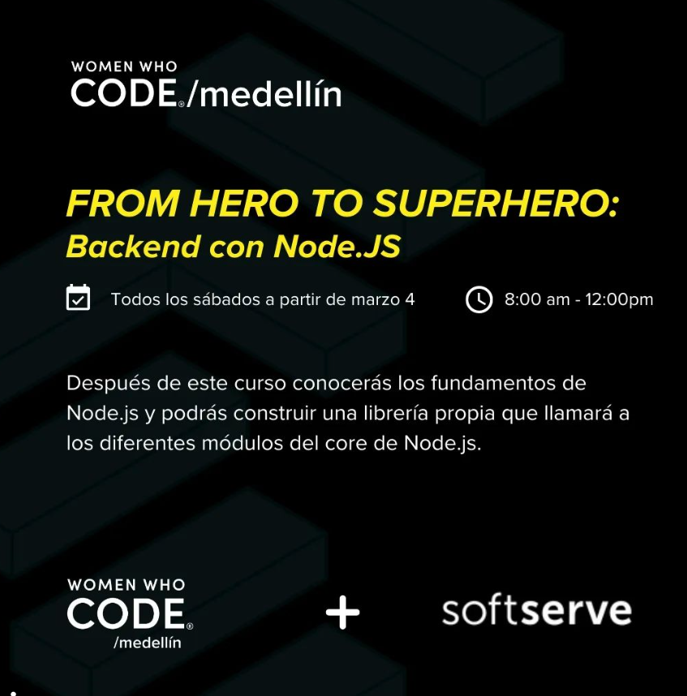

# From Hero to Superhero: Backend With Node.JS

From Hero to Superhero es un programa creado por programadores voluntarios por primera vez para #womenwhocode Medellín este 2023. Queremos continuar apoyando tu career path con un curso nuevo para que aprendas backend con #Node.js.

El curso consta de más de 40 horas teórico-prácticas y la misma cantidad de horas de aprendizaje independiente, en las que el estudiante debe realizar las tareas de cada sesión para lograr afianzar sus conocimientos.

Recuerda que nuestro propósito en Women Who Code Medellín es conectar personas con oportunidades de crecimiento profesional. En esta oportunidad, From Hero to Superhero cuenta con el patrocinio de @softserve_people y estamos muy felices de compartir con ustedes esta colaboración.

## Resources

- [NodeSchool Site](https://nodeschool.io/)
- [freeCodecamp Back End Development and APIs](https://www.freecodecamp.org/learn/back-end-development-and-apis/)
- [nodejs.dev Site](https://nodejs.dev/en/)
- [nodejs.org Site](https://nodejs.org/en)
- [Node.js Basic Tutorial](https://www.youtube.com/playlist?list=PL55RiY5tL51oGJorjEgl6NVeDbx_fO5jR)

